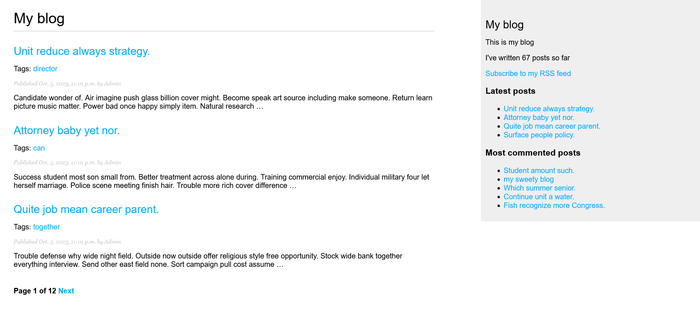

# Приложение личного блога

Учебное приложение для введения личного блога

## Возможности приложения
* Просмотр постов
  * Просмотр всех постов по тегам
  * Просмотр всех постов по страницам (пагинация)
  * Просмотр всех постов по ранжированию (самые поздние, самые популярные)
  * Просмотр всех схожих постов
* Поиск постов
* Комментирование постов
* Поделится постом через почту
* Новостная лента

## Пройденные темы
- Работа с моделями данных (`models.py`), формами (`forms.py`), представлениями (`views.py`) и пути к ним (`urls.py`) для постов
- Работа сайт администрирования (`/admin`)
- Работа с _пагинацией_, _тегированием_, _поиском_
- Работа с базой данных `PostgreSQL`

Основано на материалах книги "Django 4 в примерах [2023] Антонио Меле"